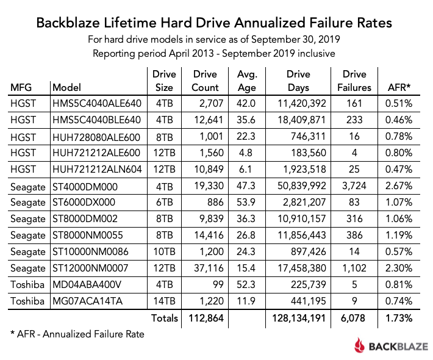

# Assignment 04

Full name (Student ID Number)

- You can answer in English or Bahasa Indonesia.
- Feel free to use chatGPT (even chatGPT Plus with o1-preview). 
  Please make sure your answer is fully correct and make sure you understand the 
  logic. A copy-and-paste answer will be graded to "D" if your trick is
  not advanced enough to fool me, 😏

## Problem 1

Given the following table

```bash
+-----------------+
|info             |
+-----------------+
|{Ended, 89, true}|
+-----------------+
```

with its schema
```bash
root
 |-- info: struct (nullable = false)
 |    |-- status: string (nullable = true)
 |    |-- weight: long (nullable = true)
 |    |-- has_watched: boolean (nullable = false)
```

Turn the table into the following form
```bash
+----------------------------------------------------+
|info                                                | 
+----------------------------------------------------+
|{status -> Ended, weight -> 89, has_watched -> true}|
+----------------------------------------------------+
```

**Hint**: First you need to create the table first, and then perform
several transformation to the table

## Problem 2  
Recreate the following table using Backblaze hard drive
datasets for a year 2019 using PySpark with the procedures
that you have learned in the class. You can also use the additional commands
from [PySpark SQL documentation](https://spark.apache.org/docs/latest/api/python/reference/pyspark.sql/index.html)

In this problem you only need to recreate the columns: `MFG`, `Model`, 
`Drive Size`, and `Drive Count`.



**Hint**: 
- If your laptop cannot handle all the dataset in 2019, you 
  can select one of the quarters (Q1, Q2, Q3, or Q4)