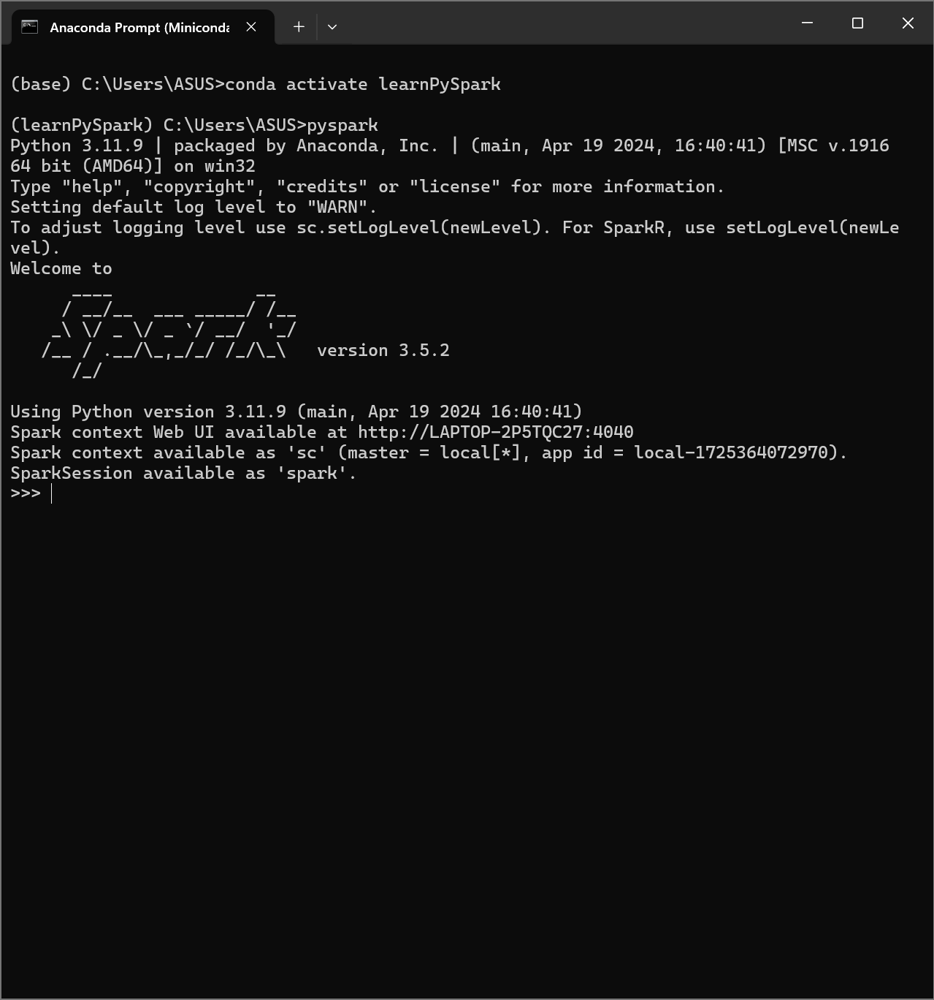

# Installation

The following tutorial is the installation of PySpark and its
configureation. We divide the installation
steps into two parts. First is the installation of Python through 
Miniconda, and we use it via Jupyter Notebook inside VSCode. 
This tutorial is tested under Windows 11 23H2.
After that we install PySpark and continue with PySpark's configuration.

We use VSCode because it is more lightweight than using
PyCharm or Spyder and it supports Jupyter Notebook with a full of ease
using VSCode extension.

## First thing you need to do
1. Uninstall all Python's related program such as PyCharm, Anaconda, and
   Python. There is a possibility that you have a Python program
   that resides outside the Anaconda and Miniconda.

2. To remove them, you can uninstall in "Add or Remove Program" menu.

3. Please follow carefully all the steps. Most of the students missed
   the step and made many typos in entering the commands.

## Python + VSCode + Jupyter Noteboook installation

### VSCode
We need VSCode to run the interface of Jupyter Notebook and to do command
editing. To install it, we can proceed with the following steps.

1. First, we need to download VSCode installer from the the following link:
   [https://code.visualstudio.com/Download](https://code.visualstudio.com/Download). Choose the installer for Window 11.

   

2. Follow the instructions that are given during installation processes.
   You can click "Next" or "Yes". After the installation has been done,
   the "Welcome Page" will be shown. If it is not shown like in the figure, 
   open VSCode application manually from Start Menu.

   

At this moment, VSCode has been installed to your computer, and we ready to
continue to the next steps which is Miniconda installation.

### Miniconda
Miniconda is a smaller version than its parent program (Anaconda). This program
is used to manage Python version that is installed to your computer. 
So we can have many version of Python programs and different version of
installed libraries. This can be achieved by using what is so called 
"environment". Most of developers use single environment for a single project.

When we have environment, we can installed without any worries about 
dependency conflicts between Python and its libraries. In this course, 
we only use "base" environment which is a default environment. There are
steps to set a new environment with different Python's version and
libraries. You can explore more about this environment management in 
[Miniconda/Anaconda documentation](https://docs.conda.io/projects/conda/en/stable/user-guide/getting-started.html)

In here, we only install for Windows users. Please proceed to the following 
steps
1. Visit the download page of Miniconda in
   [https://docs.conda.io/projects/miniconda/en/latest/](https://docs.conda.io/projects/miniconda/en/latest/).
   Then select `Miniconda3 Windows 64-bit`.

   

2. (optional) If you want to check that the downloaded file is really the 
   intended Miniconda installer, we can verify using SHA256 by typing the
   following command in Windows PowerShell. First you need to direct
   the directory of PowerShell into the location of the downloaded file
   of Miniconda installer. You can use command `cd`. Now type this
   
   ```
   Get-FileHash .\Miniconda3-latest-Windows-x86_64.exe -Algorithm SHA256
   ```

   Then, check if the code of SHA256 that is produced with the above command
   is the same as the code in the download page. If it is not the case,
   your download file is not authentic at all. It has beed tampered by
   someone and it is not safe to install it.

3. Double click to the Miniconda installer file 
   (`Miniconda3-latest-Windows-x86_64.exe`). During the installation, 
   use default setting.

4. After installation finished, you can find a program with the name
   "Anaconda Prompt (Miniconda 3)" from the Start Menu. Open that program
   to initiate the base environment.

   

At this moment, you have installed VSCode and Python and ready to continue
for the VSCode extensions and Python modules installation.

### Jupyter Notebook and other extensions and Python modules
To be able opening, editing, and running Jupyter Notebook files, we need
to install these three extension

1. Jupyter (by Microsoft)
2. Python (by Microsoft)
3. Markdown Preview Github Styling (by Matt Bierner)

Make sure that the above extensions that you are going to install have
the same name for its author (the name inside the parenthesis). There
are many extensions that share the same name but different author's name.

The following steps are only for Jupyter Notebook installation. For
the other extensions follows the same procedures.

1. Open VSCode, left click on the extension icon (an icon that is represented
   with four small blocks where the single block in the upper right is shifted).

   

2. In the "Search box", type "Jupyter". Then left click to the blue button
   with "Install". If you have done the installation for this extension,
   that blue button will not appear. You can continue the same steps
   for the two others extensions.

3. Reopen "Anaconda Prompt (Miniconda 3)" from the Start Menu, and 
   type the following commands to create new environment with the 
   name "learnPySpark". We also install some Python modules for the 
   purpose of this course

   ```
   conda create --name learnPySpark python=3.11
   conda activate learnPySpark
   ```

   Close the program after you have activated `learnPySpark`.

## PySpark installation
This is the long process of installation of PySpark in my opinion.
Follow the steps carefully, and please ask in the class if you have a problem.

### Java
There are two options of Java that we can use for PySpark installation. 
These are Java 8 and 11. But we stick to Java 8 because of compatibility 
issues in Java 11. Java 11 has many conflicts with certain third party 
libraries

1. Visit the following page to download Java 8 LTS (in the form of JDK - Java
   Development Kit) in Windows for x64 (64-bit) architecture 
   [Eclipse Temurin (TM) Latest Release](https://adoptium.net/temurin/releases/?os=windows&arch=x64&package=jdk&version=8). 
   Choose the installter with `.msi` file extension.

2. (optional) Do the checksum SHA254 to the downloaded file. See 
   the same procedure when you verify Miniconda.

3. Follow Windows's installation steps in 
   [https://adoptium.net/installation/windows/](https://adoptium.net/installation/windows/)

### Apache Spark
1. Download the latest version of Apache Spark from 
   [https://spark.apache.org/downloads.html](https://spark.apache.org/downloads.html). In our case, we use spark `3.5.2 (Aug 10 2024)`
   with a package type `Pre-build for Apache Hadoop 3.3 and later`.

2. (optional) Do the checksum SHA254 to the downloaded file. See 
   the same procedure when you verify Miniconda.

3. Extract Apache Spark installation file (`spark-3.5.2-bin-hadoop3.tgz`)
   into `C:\Users\[your user name]`.

4. Rename `spark-x.x.x-bin-haddop#` into `spark`. The sequences
   `x.x.x` and symbol `#` represent the version of PySpark and Hadoop.
   You need to write down these numbers because we use them later.

5. Download `winutils` for the Hadoop version `3.3.6` from 
   [https://github.com/cdarlint/winutils/tree/master](https://github.com/cdarlint/winutils/tree/master).
   To download a single directory instead for all versions, you can use
   the following website [https://download-directory.github.io/](https://download-directory.github.io/) and paste the directory of `hadoop-3.3.6`.

6. Extract `hadoop-3.3.6` and put all the files inside it into 
   `C:\Users\[your user name]\hadoop\`.

7. Copy `winutils.exe` and `hadoop.dll` from 
   `C:\Users\[your user name]\hadoop\bin` to 
   `C:\Users\[your user name]\spark\bin`

## Configure PySpark
This configuration needs to be performed to be able to use
`spark-submit` and writing a csv file.

### Python modules installation
Open "Anaconda Prompt (Miniconda 3)" from the Start Menu. Then type

```
conda activate learnPySpark
pip install pandas ipython ipykernel pyspark
```
This will download several Python modules that takes size around 300 MB.

### Environment variables settings

We need to set the environment variables such that PySpark will automatically
find the location of Spark program (including `winutils.exe`). To do that
we need to add environment variables and add them to the `%PATH%`.

First we set the environment variables for Hadoop and Spark. 

1. Type "Edit the system environment variables" in the "Start Menu" and click
   the program.

2. On the lower right part, there is a button "Environment Variables...".
   Click this button, and we enter the dialog window of 
   "Environment Variables" with two parts: User variables and System
   variables.

3. Create a new user variable by click "New..." in the upper part. 
   Set the the variable name to be `HADOOP_HOME` and its value
   "C:\Users\[your user name]\hadoop"

   ```
   Variable name: HADOOP_HOME
   Variable value: C:\Users\[your user name]\hadoop
   ```

4. Still in the same dialog windows when we are setting the environment
   variables for hadoop, create a new user variable again now with the 
   name and value

   ```
   Variable name: SPARK_HOME
   Variable value: C:\Users\[your user name]\spark
   ```

   And also for Python path we need to set it into our `learnPySpark` environment that is created using Miniconda. Set a new environment
   variable with the following name and value

   ```
   Variable name: PYSPARK_PYTHON
   Variable value: C:\Users\[your user name]\miniconda3\envs\learnPySpark\python
   ```

5. Now, we add these paths of `HADOOP_HOME` and `SPARK_HOME` 
   to the exsting `PATH` user variables. Click the `Path` and then
   click "Edit...". Click "New" and add `%HADOOP_HOME%\bin` and
   `%SPARK_HOME%\bin` into two separated rows.

6. Now you can test that everything is working by opening again 
   Anaconda Prompt (Miniconda 3) in the Start Menu and enter
   the `learnPySpark` environment

   ```
   conda activate learnPySpark
   pyspark
   ```

   If every steps above that you have followed are without problems,
   you will get the following results

      

   The above image is a REPL pyspark console.
   REPL stands for "Read Eval Print and Loop". This is a type of 
   interaction that you can do with pyspark console through 
   Miniconda 3 prompt.
   Type the following command to test that your Spark  
   is correctly installed

   ```py
   from pyspark.sql import SparkSession
   spark = SparkSession.builder.getOrCreate()
   ```

   If everthings is correct, you will not have any error running 
   the above two commmands lines.

## Troubleshooting

- Cannot run `conda` command in `Anaconda Prompt (Miniconda 3)`.
  - User name has whitespace??
  - Need to add the following path to `Path` environment variable??   
    ```
    C:\Users\<your user name>\miniconda3\Scripts
    ```

- Cannot run `pyspark` because of Java
  - Reinstall Temurin OpenJDK Java 8??
  - Path installation is wrong??
  - Some steps are skipped??
  - Need to add the following path to `Path` environment variable??   
    ```
    C:\Users\<your user name>\miniconda3\Scripts
    ```

  - https://medium.com/@dpk.bhtt/java-gateway-exited-java-gateway-process-exited-before-sending-its-port-number-eae90ccb990f

  - Missing C:\Windows\System32 in System Path??

- Cannot find `Edit the systems environment variables`
  - Try the following steps??    
    Control Panel > System > Advanced System Settings > Environment Variables

- Conda cannot activate automatically as a `base` environment 
  when opening Anaconda Prompt (miniconda3).   
  - Install miniconda3 with admin previlege (all users).